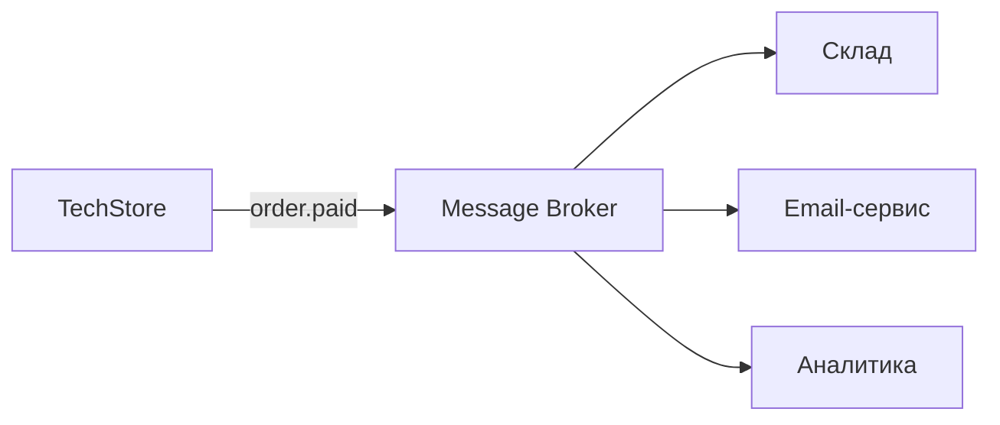

## Основные подходы

| Паттерн | Описание | Пример |
|---------|----------|--------|
| **Point-to-point API** | Прямой REST/gRPC вызов | CRM → Платёжный шлюз |
| **Message Queue** | Асинхронная очередь | Заказ создан → склад получает событие |
| **Pub/Sub** | Издатель — много подписчиков | order.created → email, аналитика, склад |
| **ETL / ELT** | Пакетная выгрузка | Ночная синхронизация в DWH |
| **ESB** | Шина enterprise-уровня | Крупные банки, госсектор |

## Sync vs Async

**Синхронно:** вызывающая система ждёт ответа. Проще отладка, но связность по времени.

**Асинхронно:** отправил сообщение — пошёл дальше. Выше отказоустойчивость, сложнее трассировка.

## Что описывает аналитик в интеграции

1. Источник и потребитель
2. Триггер (событие или расписание)
3. Формат данных (JSON schema)
4. Обработка ошибок и повторов
5. SLA (время доставки, допустимая задержка)
6. Идемпотентность

## Диаграмма: событие «Заказ оплачен»

