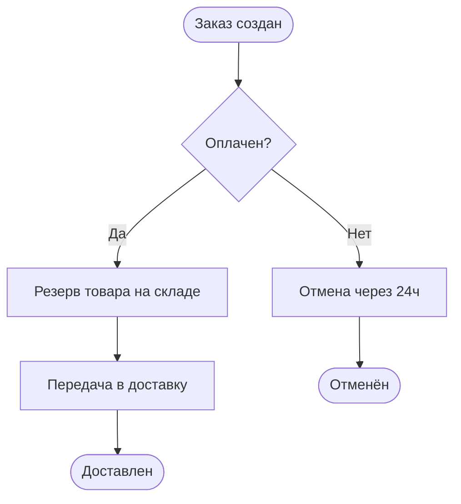

## Зачем BPMN аналитику?

BPMN (Business Process Model and Notation) позволяет показать **кто**, **что** и **в каком порядке** делает — без привязки к коду.

## Основные элементы

| Элемент | Обозначение | Назначение |
|---------|-------------|------------|
| Start Event | ○ | Начало процесса |
| Task | ▭ | Действие |
| Gateway | ◇ | Ветвление (да/нет) |
| End Event | ◎ | Завершение |
| Pool / Lane | ═══ | Участник / роль |

## Пример: обработка заказа в TechStore

## Практические советы

1. Один процесс — одна цель (не смешивайте «оформление» и «возврат»)
2. Именуйте задачи глаголом: «Проверить оплату», не «Оплата»
3. Шлюзы — только для решений, не для параллельности без нужды
4. Указывайте системы в lane: «Покупатель», «CRM», «Склад»

## Связь с требованиями

Каждая **задача** на диаграмме часто превращается в user story или use case.
Каждый **шлюз** — набор acceptance criteria и исключений.

## Практика

Нарисуйте BPMN (можно в draw.io или mermaid) для процесса обработки тикета поддержки:
открытие → назначение сотрудника → решение → закрытие.
