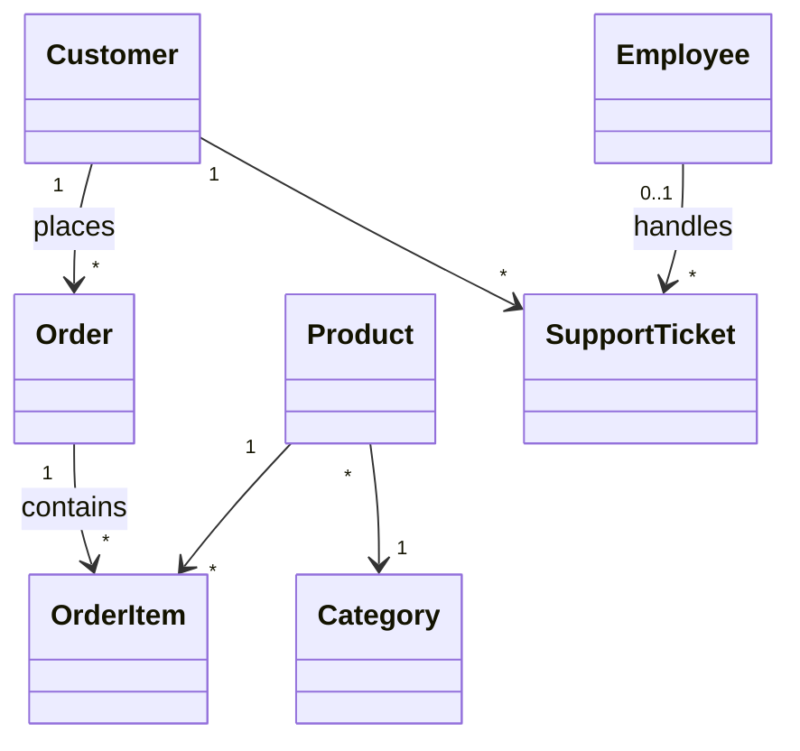
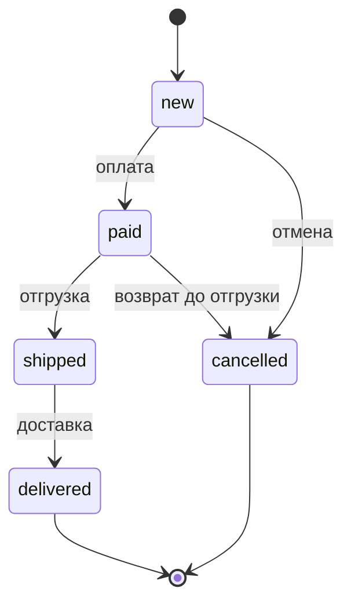
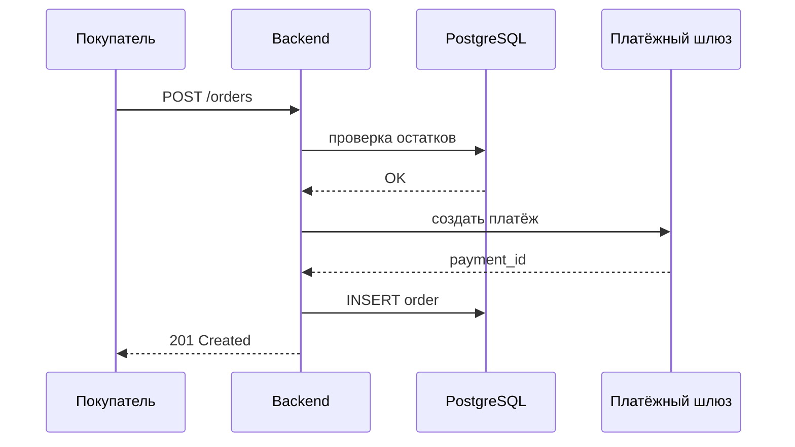

## Какие диаграммы реально нужны

Аналитику редко нужны все 14 типов UML. Чаще всего:

1. **Диаграмма классов** — структура данных и связи
2. **Диаграмма последовательностей** — порядок вызовов при сценарии
3. **Диаграмма состояний** — жизненный цикл сущности (заказ, тикет)
4. **Диаграмма use case** — акторы и границы системы

## Диаграмма классов (фрагмент TechStore)

## Диаграмма состояний: заказ

## Диаграмма последовательностей: оформление заказа

## Советы

- Не перегружайте диаграмму — 5–9 элементов оптимально
- Подписывайте кратности связей (1..*, 0..1)
- Для API-сценариев sequence diagram особенно полезна на ревью с разработчиками
